<a name="readme-top"></a>
# Auto Insurance Fraud Detection

> The goal of this research is to build a binary classifier model that can separate
> fraudulent auto insurance claims from legitimate ones, and to **explain** its predictions
> well enough to support a human investigator.

**Author:** Meshwa Patel (Student ID: 501390663)
**Program:** Master of Science in Data Science and Analytics — Major Research Project (MRP)

---

## Table of Contents
1. [About the Project](#about-the-project)
2. [Research Objective](#research-objective)
3. [Evaluation Metrics](#evaluation-metrics)
4. [Getting Started](#getting-started)
5. [Data Workflow](#data-workflow)
   - [Dataset](#dataset)
   - [Data Cleaning](#data-cleaning)
   - [Exploratory Data Analysis](#exploratory-data-analysis)
   - [Methodology](#methodology)
   - [Modelling](#modelling)
   - [Model Explainability (SHAP)](#model-explainability-shap)
   - [Fraud Risk Score](#fraud-risk-score)
   - [Fairness Check](#fairness-check)
   - [Robustness Checks](#robustness-checks)
   - [External Validation](#external-validation)
6. [Results Summary](#results-summary)
7. [Repository Structure](#repository-structure)
8. [License](#license)

---

## About the Project

Insurance fraud is dynamic and rarely follows a fixed pattern, which makes it hard to detect.
Fraudulent auto claims, ranging from mild exaggeration to fully staged accidents, cause large
financial losses for insurers, and those losses are passed back to honest customers as higher
premiums. The challenge is that a fraudulent claim is usually designed to look exactly like a
genuine one.

This project applies multiple machine learning techniques to classify claims as fraudulent or
legitimate. Before modelling, exploratory data analysis is used to understand how the
categorical and numerical features relate to the fraud label — and that EDA also turned up
something not in the original plan: strong statistical evidence that the main dataset is
**synthetic** (near-zero skew, suspiciously uniform category proportions, almost no inter-feature
correlation). This doesn't invalidate the comparison between methods, but it does cap how good
any model can realistically get on this file, which is exactly why external validation on real
data (see below) matters so much here.

Because the data is heavily imbalanced (only about 11.5% of claims are fraudulent), the
**Synthetic Minority Over-sampling Technique (SMOTE)** is applied, and every model is trained
both **with and without** SMOTE so the effect of resampling can be measured rather than assumed.

**Four** classifiers — **Logistic Regression, Random Forest, XGBoost, and a Neural Network**
(MLP) — are compared under identical preprocessing. *(The original proposal scoped three models;
the Neural Network was added afterward to rule out non-linear structure the other three might be
missing.)* The best model is explained using **SHAP** (global and per-claim) and cross-checked
with an independent feature-ablation test, and its signals are turned into a transparent
rule-based **Fraud Risk Score** for investigator use. Beyond the original proposal, the project
also includes a **fairness audit and mitigation**, a battery of **robustness checks** (grid
search, threshold sweep, ablation, significance test, calibration, cost-based value analysis),
and **external validation on three independent real-world datasets**. The approach is evaluated
using **precision, recall, F1-score**, and the **Area Under the ROC Curve (AUC)**.

## Research Objective

> *Can a machine learning model accurately identify fraudulent auto insurance claims using
> structured claim and policyholder data, and can the model's decisions be explained well
> enough to support a human investigator?*

The project compares four machine learning models and reports its conclusions using
**Recall** and **AUC Score** as primary metrics, since the dataset is imbalanced, alongside
Precision and F1.

## Evaluation Metrics

Because the data is imbalanced, **accuracy is misleading** — a model that predicts "never
fraud" would score about 88.5% accuracy while catching zero fraud. The project therefore relies
on:

- **Precision** — of all claims flagged as fraud, how many were actually fraud.
- **Recall** — of all real frauds, how many the model caught.
- **F1-Score** — the balance of precision and recall; the primary model-selection metric.
- **AUC-ROC** — how well the model ranks claims by risk. An AUC near 1.0 indicates strong
  separability; an AUC near 0.5 is no better than chance.

A high recall with an acceptable AUC is the key parameter for selecting the best model, since
in fraud detection a missed fraud is usually costlier than a false alarm that an investigator
can dismiss.

## Getting Started

1. Clone the repository:
   ```bash
   git clone https://github.com/<your-username>/Auto-Insurance-Fraud-Detection.git
   cd Auto-Insurance-Fraud-Detection
   ```
2. Install the required libraries:
   ```bash
   pip install pandas numpy scikit-learn xgboost imbalanced-learn shap seaborn matplotlib jupyter
   ```
3. Launch Jupyter and run the notebooks **in order** (01 → 02 → 03_modelling_1); notebook
   `04_external_testing` is independent and can be run any time after 01:
   ```bash
   jupyter notebook
   ```

All figures are saved as PNG files to the `figures/` folder as the notebooks run.

## Data Workflow

### Dataset

The main dataset is a **Car Insurance Fraud** dataset containing **30,000 claims and 24
features** plus the target. It is highly imbalanced: **3,440 (11.5%)** claims are fraudulent and
**26,560 (88.5%)** are legitimate, a ratio of roughly 7.7 : 1.

| Column | Description |
| --- | --- |
| `policy_state` | State where the policy was issued |
| `policy_deductible` | First-pay deductible amount |
| `policy_annual_premium` | Annual premium paid by the insured |
| `insured_age` | Age of the insured person |
| `insured_sex` | Gender of the insured |
| `insured_education_level` | Education level of the insured |
| `insured_occupation` | Occupation category |
| `insured_hobbies` | Hobby of the insured |
| `incident_type` | Type of incident |
| `collision_type` | Type of collision |
| `incident_severity` | Severity of the damage |
| `authorities_contacted` | Authority contacted at the incident |
| `incident_state` / `incident_city` | Location of the incident |
| `incident_hour_of_the_day` | Hour the incident occurred |
| `number_of_vehicles_involved` | Number of vehicles involved |
| `bodily_injuries` | Number of bodily injuries |
| `witnesses` | Number of witnesses |
| `police_report_available` | Whether a police report was filed |
| `total_claim_amount` | Total claim amount |
| `fraud_reported` | **Target:** Y = fraudulent, N = legitimate |

Beyond the raw columns, three external datasets are used purely for validation — see
[External Validation](#external-validation) — and are **not** the same schema as the main file;
they are handled honestly rather than treated as interchangeable.

### Data Cleaning

Cleaning was deliberately light, since the data was already well structured. The steps were:

- Filling the only column with missing values, `authorities_contacted` (25.2% missing), with
  the category `"None"` — interpreting a blank as "no authority contacted." This turned out to
  be one of the strongest fraud predictors in the dataset, so the missingness itself was signal,
  not just noise to be dropped.
- Parsing `incident_date` into a proper date type.
- Standardising text categories by trimming whitespace.
- Creating a numeric target `fraud` (1/0) from `fraud_reported` (Y/N).

The data was then split in a **stratified** way into **70% training, 15% validation, and 15%
test**, preserving the 11.5% fraud rate in each subset, with the test set touched exactly once.

```python
x_train, x_temp, y_train, y_temp = train_test_split(
    X, y, test_size=0.30, random_state=42, stratify=y)
x_valid, x_test, y_valid, y_test = train_test_split(
    x_temp, y_temp, test_size=0.50, random_state=42, stratify=y_temp)
```

### Exploratory Data Analysis

The central finding of the EDA is that the **fraud signal is weak and diffuse** — no single
feature cleanly separates fraud from legitimate claims — and that the dataset shows strong
statistical fingerprints of being **synthetic**.

**Target distribution.** The strong class imbalance is the most important property of the data.

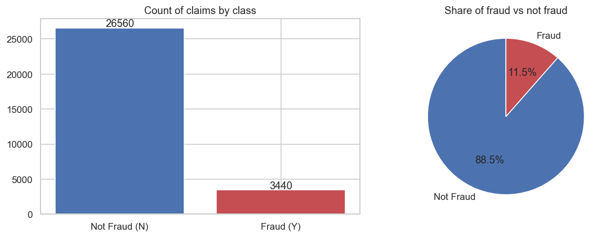

**Correlation.** No numeric feature is strongly correlated with the target — only 2 of 64
feature pairs show any real relationship — confirming that fraud must be inferred from many
weak signals rather than one dominant variable.

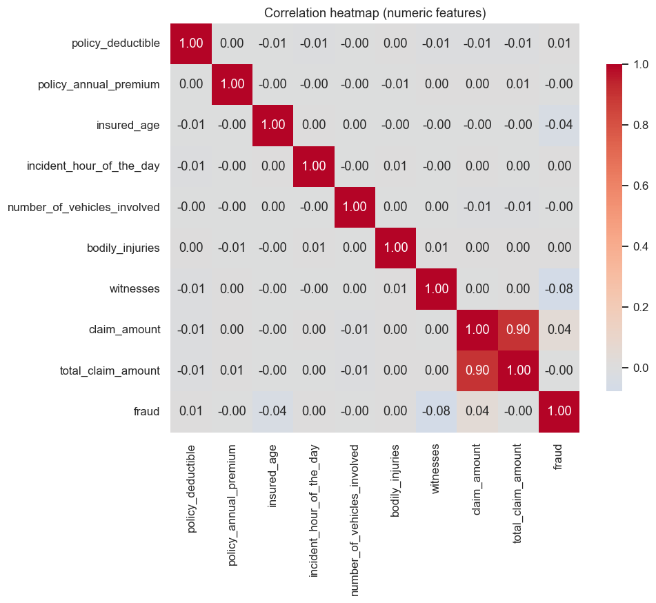

**Incident features.** Incident severity is the clearest single predictor — "Total Loss" claims
are fraudulent about 14.8% of the time versus roughly 9.6% for "Minor Damage" — but the spread
is still narrow.

**Synthetic-data check.** Four independent statistical checks — near-zero skew/kurtosis on
numeric features, suspiciously uniform category proportions (e.g. every occupation between
12.3–12.7% of the data), near-zero inter-feature correlation, and unnaturally even geographic/
temporal spread — together point to a synthetically generated dataset. This was not requested
by the proposal; it was found during EDA and is disclosed here for honesty. It does not
invalidate model comparison, but it does mean absolute performance numbers on this file should
be read cautiously and weighed against the external validation results below.

### Methodology

The overall workflow runs from raw data through cleaning, EDA, feature engineering, the
train/validation/test split, model training with and without SMOTE (×4 models), evaluation,
explainability, a fairness check, robustness checks, and external validation.

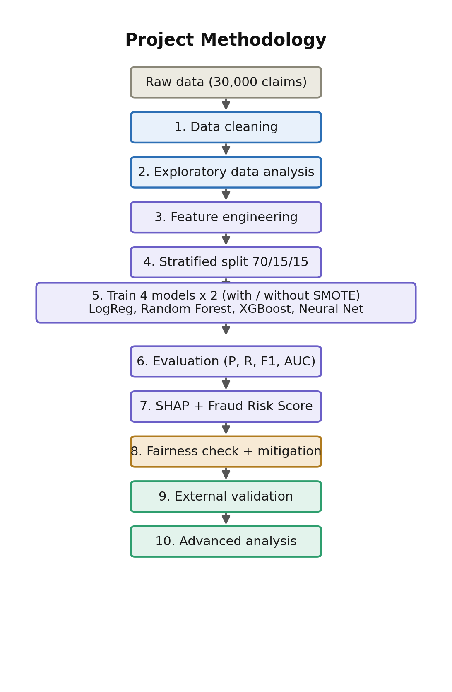

Seven engineered features were added (claim-to-premium ratio, red-flag indicators such as no
witnesses / no police report, a severity score, and time-based features). Numeric features are
standardised and categorical features one-hot encoded inside a single `ColumnTransformer`, so
identical preprocessing applies to all splits and prevents data leakage. SMOTE is applied
**inside the pipeline** so synthetic minority examples are generated only from the training
folds.

### Modelling

Each of the four models was trained twice — on the original imbalanced data and with SMOTE —
giving **eight** configurations evaluated on the validation set.

| Model | Data | Precision | Recall | F1 | AUC-ROC |
| --- | --- | --- | --- | --- | --- |
| Logistic Regression | Original | 0.364 | 0.016 | 0.030 | 0.698 |
| Logistic Regression | SMOTE | 0.207 | 0.612 | **0.335** | 0.695 |
| Random Forest | Original | 0.333 | 0.004 | 0.008 | 0.740 |
| Random Forest | SMOTE | 0.434 | 0.045 | 0.081 | 0.736 |
| XGBoost | Original | 0.440 | 0.099 | 0.161 | 0.731 |
| XGBoost | SMOTE | 0.431 | 0.103 | 0.166 | 0.731 |
| Neural Network | Original | — | 0.000 | 0.000 | 0.702 |
| Neural Network | SMOTE | 0.198 | 0.549 | 0.291 | 0.699 |

*Logistic Regression + SMOTE is the winner by F1, and by a wide margin — nearly double the
next-best configuration. Test-set numbers for the winning model (Precision 0.222, Recall 0.686,
F1 0.335, AUC-ROC 0.726) are reported separately below, since the table above is validation-set
performance used for model selection.*

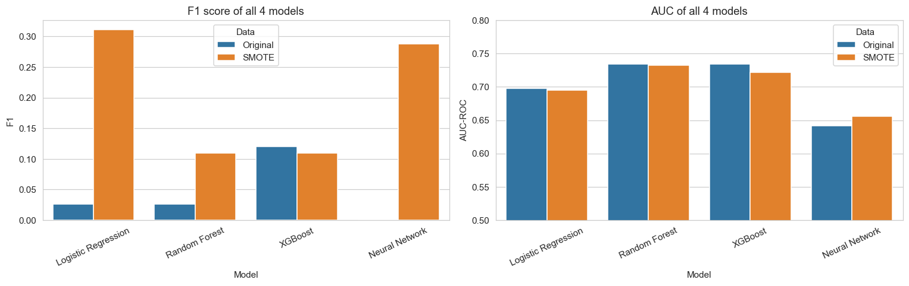

The clearest pattern is the **effect of SMOTE on recall**: without it, every model has
near-zero recall (Logistic Regression 1.6%, the Neural Network essentially 0%) because it's
easiest to just predict "not fraud" for almost everything. With SMOTE, Logistic Regression's
recall jumps to **61.2%** — the largest single change in the project. Notably, AUC barely moves
(0.698 → 0.695), which shows SMOTE shifts the decision **threshold** rather than improving the
model's underlying ability to rank risk.

The best model by validation F1 is **Logistic Regression with SMOTE** — also the simplest and
most interpretable model in the comparison, beating both tree ensembles and the neural network.

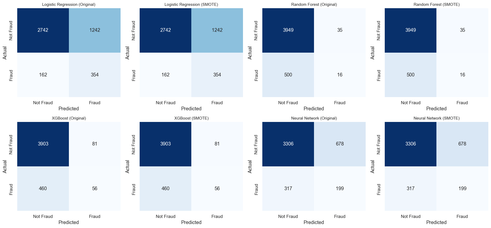

On the held-out **test set**, the best model achieved **Precision 0.222, Recall 0.686, F1
0.335, and AUC-ROC 0.726**, consistent with validation (no overfitting). Out of 516 true
frauds in the test set, 354 were caught and 162 missed, with 1,242 false alarms; the missed
frauds tend to carry fewer red flags (12.3% no-witness vs. 40.7% for caught frauds), so the
errors follow a structured, explainable pattern rather than being random.

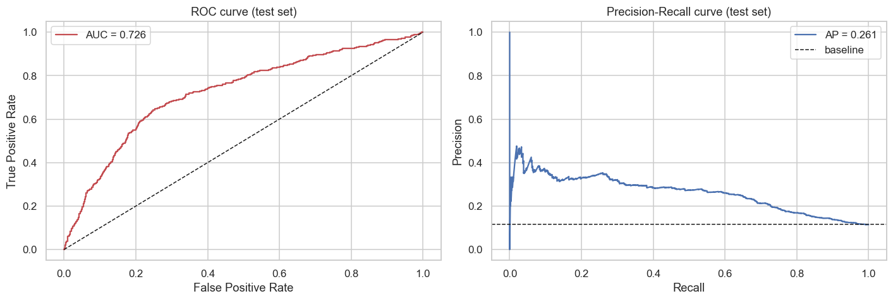

### Model Explainability (SHAP)

SHAP is used to open up the model. The global importance and beeswarm plots show that whether
authorities were contacted, the no-witness flag, the claim-to-premium ratio, and claimant age
are the top drivers, and they come out roughly equal — no single feature dominates.

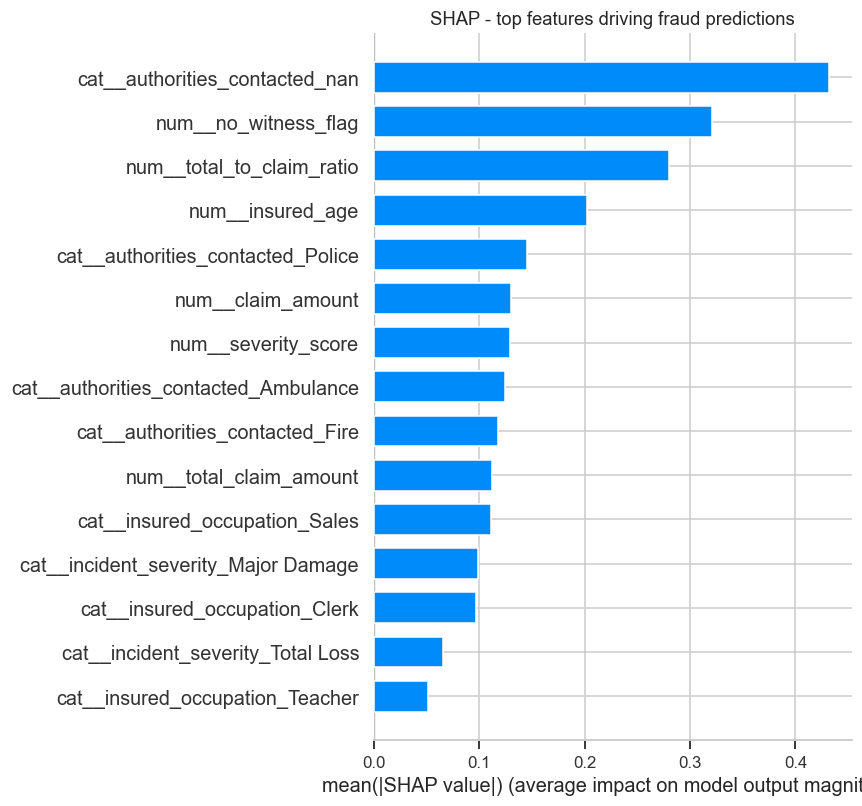
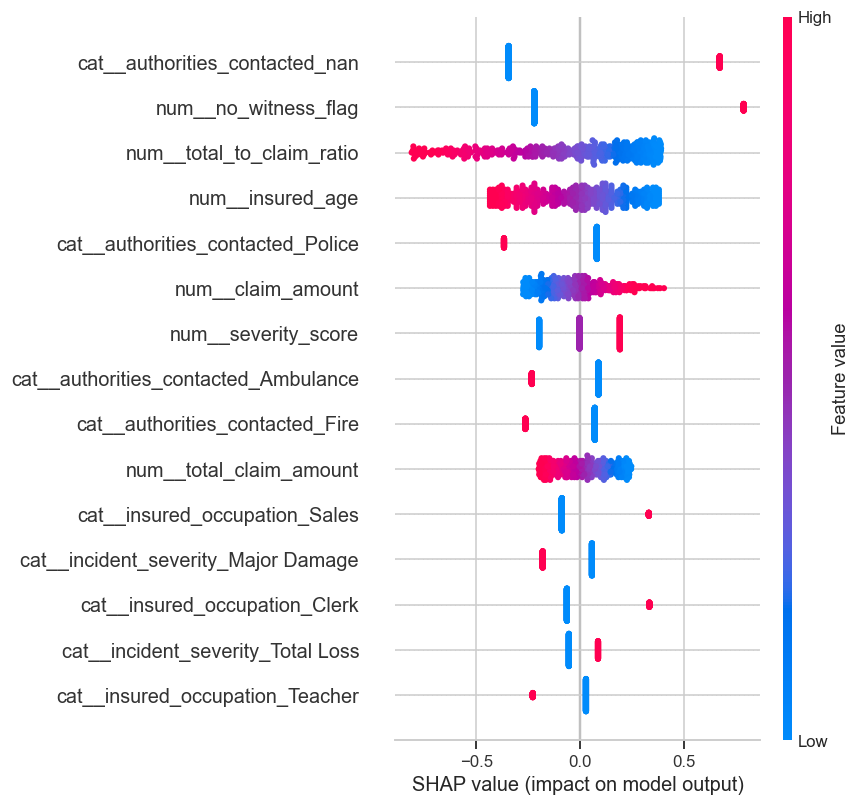

As an independent cross-check (beyond what SHAP alone provides), each feature group was also
removed one at a time and the model re-evaluated. Removing the authorities-contacted information
caused the largest drop of any group tested (**−0.070 AUC**), matching SHAP's top-ranked feature
and giving two independent methods that agree.

### Fraud Risk Score

A transparent, rule-based score assigns points for human-readable red flags (total-loss
severity, no witnesses, a very high claim, a young claimant, etc.). Point values were not
guessed — each candidate flag's actual lift in fraud rate above baseline was measured, and only
flags clearing a real threshold were kept. Claims are then sorted into **Low / Medium / High**
tiers. Fraud rates rise from **8.8% (Low)** to **10.9% (Medium)** to **26.7% (High)** — the High
tier is roughly three times the Low tier — validating the score as a triage tool an investigator
can read without touching the model.

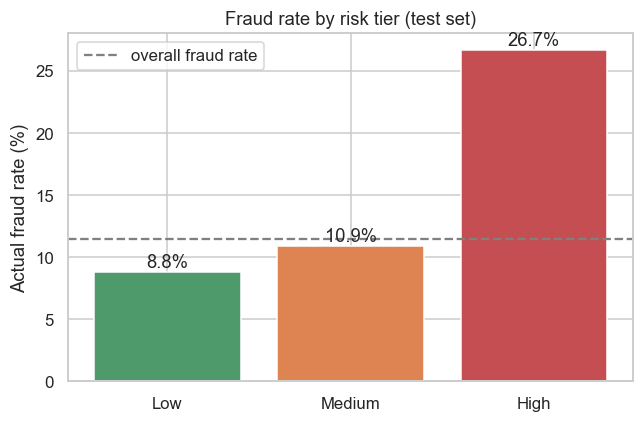

### Fairness Check

*(Beyond the original proposal.)* The best model's behaviour was broken down by demographic
group. The model **over-flags younger claimants** relative to their actual fraud rate — about
47% of under-30 claimants were flagged versus a 13.6% real offense rate for that group. The
model was then retrained without age, sex, and education to correct this. F1 barely moved
(**0.335 → 0.338**, essentially unchanged) while the unfair flagging gap shrank substantially —
the fix cost next to nothing.

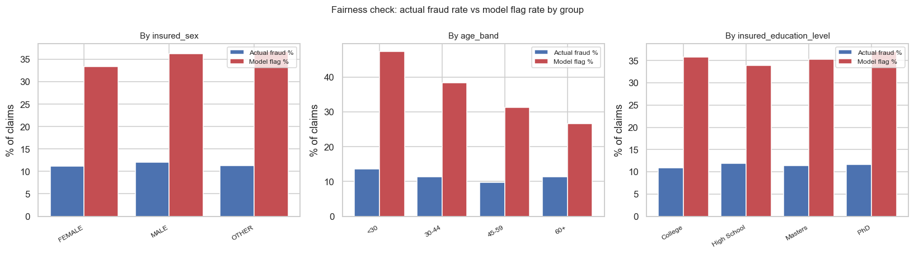
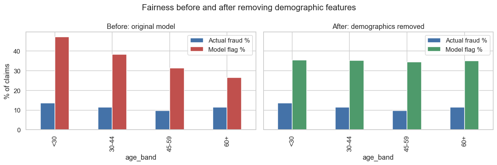

### Robustness Checks

*(Beyond the original proposal.)* To stress-test the headline result before reporting it, several
additional checks were run: a grid search over hyperparameters, a decision-threshold sweep,
the feature-ablation check described above, a statistical significance test (McNemar's test)
comparing model configurations, a calibration check (Brier score / reliability curve) showing
the model's probabilities are usable for ranking but not perfectly calibrated, repeated
cross-validation to confirm the result isn't a lucky split, and a cost-based value analysis.

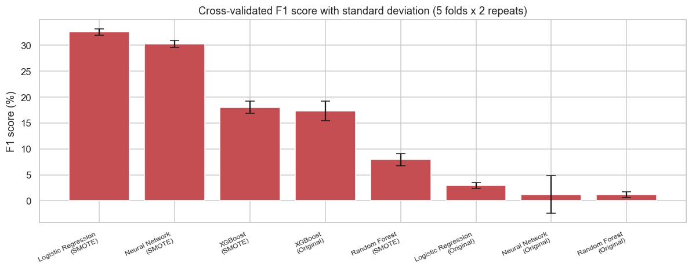
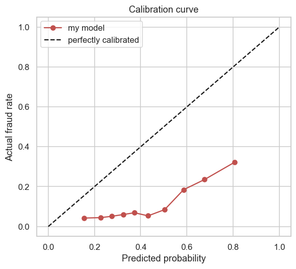

The cost analysis shows that, used as a ranking tool, reviewing just the top 1,000 riskiest
claims catches **53.5%** of all fraud in the dataset — worth roughly **$4.25M** in net value on
the test set alone at a $200/claim review cost assumption.

### External Validation

*(Beyond the original proposal — the proposal did not call for testing on outside data.)* To
check whether the pipeline generalises, the exact same trained pipeline was applied to three
independent, real-world datasets it had never seen.

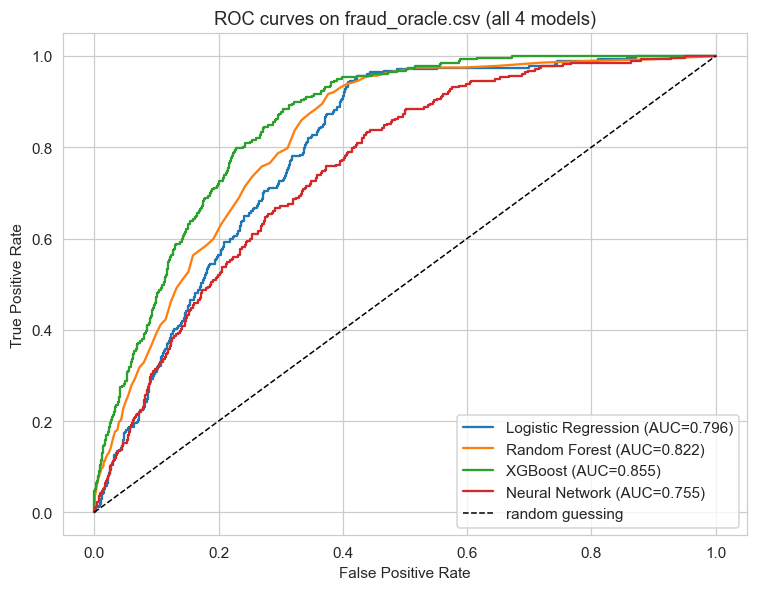

The first transfer attempt scored a weak **AUC of 0.374** — worse than chance — which raised the
question of whether the *data* or the *method* was at fault. Retraining fresh on 70% of that
same dataset and testing on the remaining 30% recovered an AUC of **0.784**, showing there was
real signal in that data all along; the original failure was a **domain gap** (a model needs to
be retrained per portfolio, not blindly transferred), not a broken method. A second, completely
independent benchmark dataset then reached **AUC 0.855** — the best score anywhere in the
project, on real data. This is the key cross-dataset evidence: the method is sound, and the
comparatively modest results on the main training dataset reflect that dataset's weak,
likely-synthetic signal rather than a flawed approach.

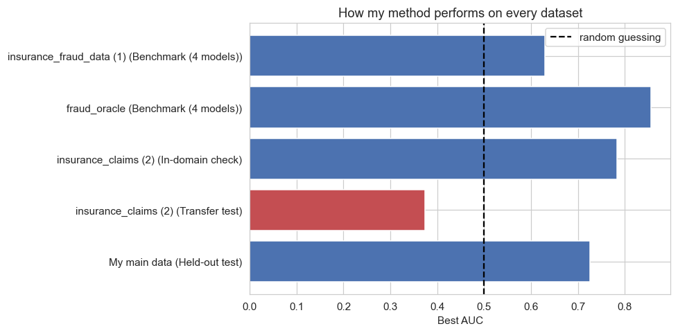

## Results Summary

- The fraud signal in the main dataset is **weak and diffuse**, and four independent statistical
  checks point to the dataset being **synthetic** — disclosed openly, not hidden.
- The best model (**Logistic Regression + SMOTE**, the simplest of four models compared) reached
  a test **F1 of 0.335** and **AUC-ROC of 0.726**, with Recall 0.686 and Precision 0.222. It is a
  **triage / ranking tool**, not an automatic accept/reject system.
- **SMOTE shifts the decision threshold** (recall 1.6% → 61.2%) rather than improving the
  model's underlying ranking ability (AUC 0.698 → 0.695 — essentially flat).
- The rule-based **risk score** works as triage: High tier 26.7% fraud rate vs. 8.8% Low tier.
- SHAP and an independent **feature-ablation** check agree on the top driver: whether
  authorities were contacted.
- A **fairness audit** found the model over-flags claimants under 30; removing demographic
  features **fixed the gap at essentially no cost to F1** (0.335 → 0.338).
- **Robustness checks** (grid search, threshold sweep, ablation, significance test, calibration,
  cost analysis) all support the headline result; as a ranking tool, the top 1,000 riskiest
  claims capture 53.5% of all fraud, worth ~$4.25M net on the test set.
- **External validation** on three real datasets: a transfer test scored AUC 0.374 (domain gap),
  an in-domain retrain on that same data recovered AUC 0.784, and an independent benchmark
  dataset reached AUC 0.855 — the pipeline performs *better* on real data than on the main
  (likely synthetic) training set, confirming the method itself is sound.

## Repository Structure

```
.
├── notebooks/
│   ├── 01_data_cleaning.ipynb      # Clean the main dataset, build the target
│   ├── 02_eda.ipynb                # EDA + synthetic-data checks + charts
│   ├── 03_modelling_1.ipynb        # 4 models × SMOTE, SHAP, risk score, fairness, robustness
│   └── 04_external_testing.ipynb   # Apply the pipeline to 3 external datasets
├── data/
│   ├── raw/                        # Place the raw CSV files here
│   └── car_insurance_clean.csv     # Output of notebook 01 (cleaned data)
├── figures/                        # All charts saved by the notebooks (PNG)
├── Literature_Review_Meshwa_Patel.docx
├── requirements.txt
└── README.md
```

## License

Distributed under the MIT License. See `LICENSE` for details.

<p align="right">(<a href="#readme-top">back to top</a>)</p>

